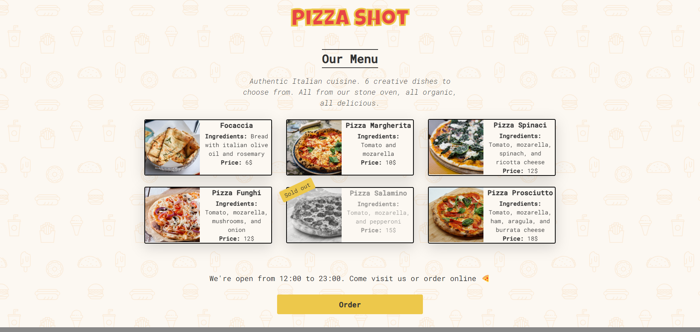

# React Project Template

This project is a React application bootstrapped with [Create React App](https://create-react-app.dev/). It serves as a template for quickly setting up React projects with a standardized development environment.

## Table of Contents

1. [Introduction](#introduction)
2. [Installation](#installation)
3. [Usage](#usage)
4. [Live Demos](#live-demos)
5. [Screenshots](#screenshots)
6. [Contributing](#contributing)
7. [License](#license)

## Introduction

The Pizza Ordering System is a web-based application built with React, allowing users to browse through a variety of pizzas, customize their orders, and place them seamlessly. With an intuitive user interface, a wide range of pizza options, and a secure ordering process, our system aims to elevate the pizza ordering experience.

Key features:

- **Interactive Pizza Menu:** Explore a diverse menu with various pizza options and toppings.
- **Customization:** Customize your pizza with your favorite toppings and crust options. (coming soon)
- **User Authentication:** Securely log in to your account for a personalized ordering experience.(coming soon)
- **Order Tracking:** Track the status of your order in real-time. (coming soon)

## Installation

Follow these steps to set up the Pizza Ordering System locally:

```bash
# Clone the repository
git clone https://github.com/your-username/pizza-ordering-system.git

# Navigate to the project directory
cd pizza-ordering-system

# Install dependencies
npm install
```

## Usage

1. **Clone the Repository:**
   ```bash
   git clone https://github.com/your-username/pizza-ordering-system.git
   ```
2. **Navigate to the Project Directory:**

```bash
   cd pizza-ordering-system
```

3. **Install Dependencies:**

```bash
   npm install
```

4. **Run the Application:**

```bash
   npm start
```

## Live Demo

Explore the live demo of the Pizza Ordering System:

[🍕 Live Demo](https://pizza-menu-swart.vercel.app/)

Feel free to interact with the application, customize your pizza, place orders, and experience the seamless pizza ordering process firsthand.

## Screenshots

### Demo



---

## Contributing

We welcome contributions! Please follow these guidelines:

1. Fork the repository and clone it locally.
2. Create a new branch for your feature or bug fix.
3. Make your changes and ensure tests pass.
4. Commit your changes with a clear and descriptive commit message.
5. Push your branch to your fork on GitHub.
6. Open a pull request, providing a detailed description of your changes.

Thank you for contributing!

---

## License

This project is licensed under the MIT License - see the [LICENSE](LICENSE.md) file for details.
